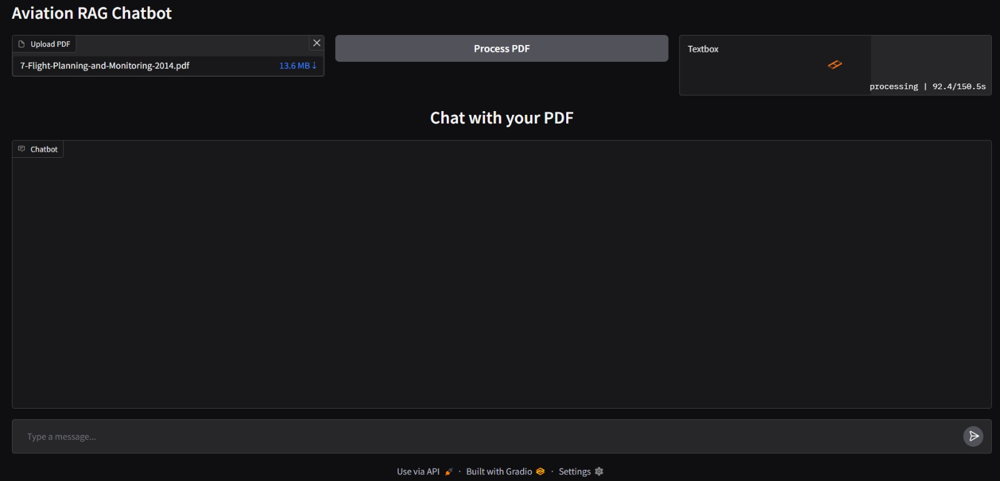
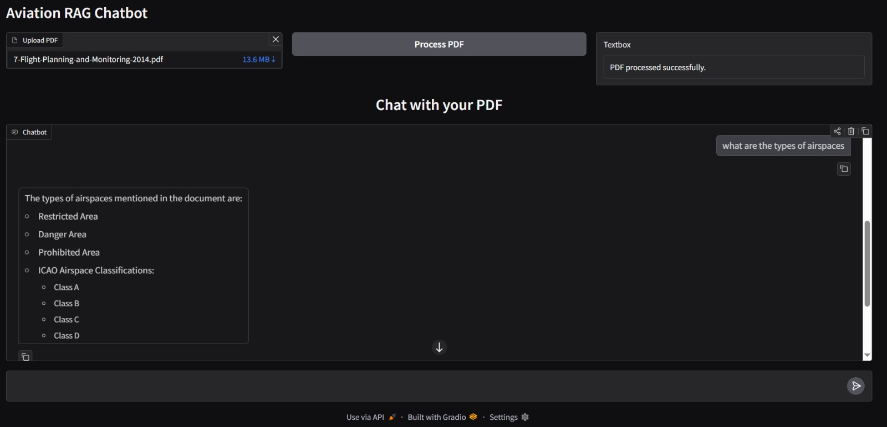
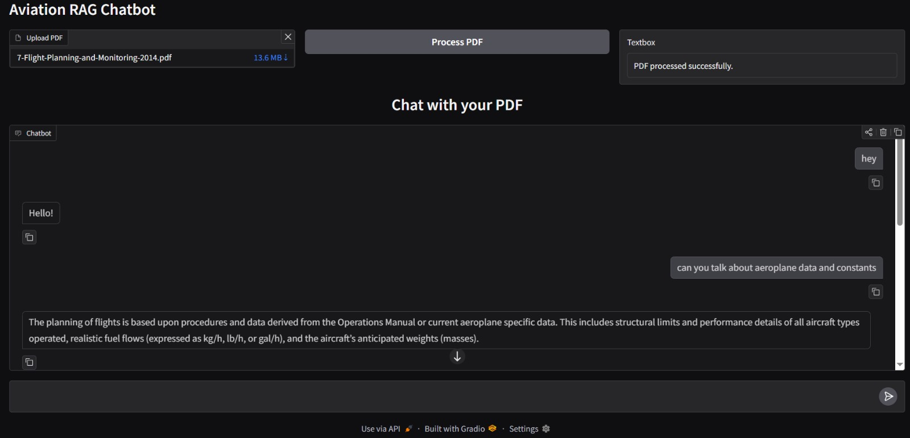

# ✈️ Aviation RAG Chatbot

A Deep-Domain Aviation Knowledge Assistant using RAG

This project implements a Retrieval-Augmented Generation (RAG) chatbot built specifically for aviation domain understanding, using five aviation textbooks as the knowledge base.

The system provides:

--🧠 Deep aviation knowledge reasoning

--📄 PDF ingestion pipeline

--🔎 Semantic retrieval with FAISS

--💬 Interactive Gradio chatbot UI

--🚀 Production-ready FastAPI endpoints

## 🏗️ Project Architecture

The project consists of two main components:

1️⃣ ragchat.py – Gradio Chatbot Interface

--Upload aviation PDFs

--Create FAISS vector index

--Ask domain-specific aviation questions

--Get context-grounded answers

--Chat-style interface for interactive exploration

2️⃣ app.py – FastAPI Backend

--Provides REST endpoints:

--POST /ingest → Upload and process PDF

--POST /ask → Ask question against ingested documents

Structured API response includes:

--✅ Answer

--✅ Citations (Document name + page / chunk ID)

--✅ Retrieved chunks (when debug flag enabled)

## 📁 Project Structure
```
├── ragchat.py        # Gradio RAG chatbot interface
├── app.py            # FastAPI backend with ingest & ask endpoints
├── requirements.txt
├── .env
└── README.md
```
## ⚙️ Installation
```
git clone <your-repo-url>
cd <project-folder>
```

## 🔐 Environment Variables
Create a .env file:
```
GOOGLE_API_KEY=your_google_api_key
```
## 💬 Run Gradio Chatbot
```
python ragchat.py
```
Processing the pdf


Chat Responses 



## 🚀 Run FastAPI Server

```
uvicorn app:app --reload
```
Open:
```
http://127.0.0.1:8000/docs
```
Swagger UI allows:

Uploading PDF via /ingest

Asking aviation questions via /ask

## 🧪 Example API Request
POST /ask

```
{
  "question": "Explain the principles of lift in fixed-wing aircraft",
  "debug": true
}
```
Response Format

```
{
  "answer": "...",
  "citations": [
    {
      "document": "aerodynamics.pdf",
      "page": 42,
      "chunk_id": 7
    }
  ],
  "retrieved_chunks": [
    {
      "chunk_id": 7,
      "page": 42,
      "snippet": "Lift is generated due to pressure differential..."
    }
  ]
}
```


